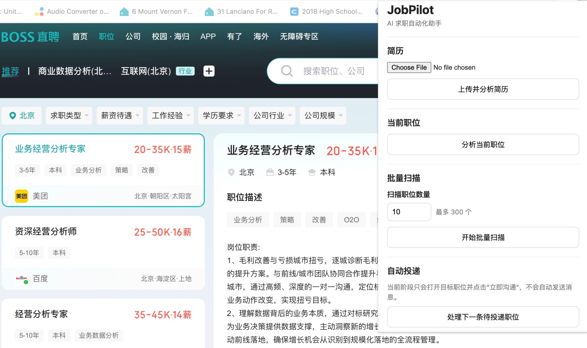
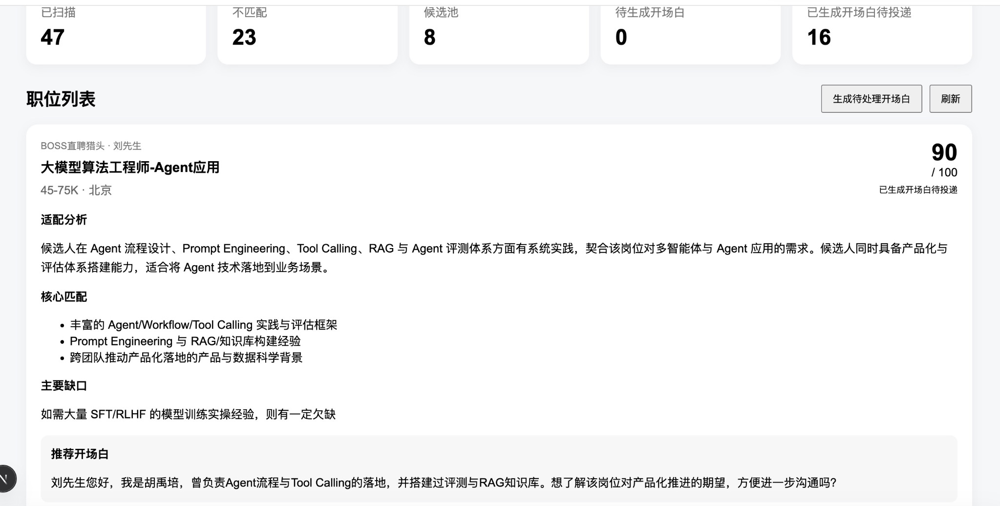

# JobPilot --- AI 求职 Copilot

> 基于 LLM、浏览器自动化与 Agent Workflow 构建的 AI
> 求职助手，实现从职位扫描、结构化抽取、智能匹配到个性化沟通与求职流程管理的自动化
> Pipeline。

## 项目简介

JobPilot 是一个面向高频求职场景设计的 **AI Job Search Copilot / Job
Search Agent**。

传统求职需要反复完成搜索职位、阅读
JD、判断匹配度、筛选岗位、撰写开场白、联系招聘者和跟踪进度。JobPilot
将这一过程拆解为可执行的 AI Workflow，通过 Chrome Extension、DOM
Extraction、Candidate Fact Base、LLM Fast Match、Batch
Inference、Greeting Generation、Application State
Machine、Human-in-the-Loop 与 Web Dashboard，将人工逐职位筛选转化为：

``` text
批量扫描 → AI 初筛 → 职位分流 → 人工 Review → 个性化沟通
→ 招聘者回复 → 深度岗位分析 → 定制简历 → 投递 / 面试管理
```

当前稳定版本已经完成：

**职位扫描 → 信息抽取 → Candidate Profile → Batch Fast Match → AI 分流 →
Dashboard → Greeting Generation**

Browser Agent 正在开发中。

## Demo

### Chrome Extension：职位扫描与自动化入口

JobPilot Chrome Extension 直接运行在 BOSS 直聘职位页面中，支持简历上传、当前职位分析、批量扫描以及后续 Browser Agent 自动投递流程。



### Dashboard：AI 匹配分析与 Greeting Generation

Dashboard 汇总职位 Pipeline 状态，并展示每个职位的 Match Score、适配分析、核心匹配、主要缺口以及个性化招聘者开场白。



# 快速开始

## 环境要求

-   Node.js 18+
-   npm
-   Google Chrome
-   OpenAI API Key
-   BOSS 直聘账号

## 1. Clone 项目

``` bash
git clone <YOUR_REPOSITORY_URL>
cd jobpilot
npm install
```

## 2. 配置环境变量

在项目根目录创建 `.env.local`：

``` env
OPENAI_API_KEY=your_openai_api_key
OPENAI_MODEL=your_model_name
```

请勿将 `.env.local` 或 API Key 提交至 GitHub。

## 3. 启动 JobPilot

``` bash
npm run dev
```

当前开发环境默认运行于：

``` text
http://localhost:3001
```

打开该地址即可进入 JobPilot Dashboard。

## 4. 安装 Chrome Extension

在 Chrome 打开 `chrome://extensions`，开启 **开发者模式（Developer
Mode）**，点击 **加载已解压的扩展程序**，选择：

``` text
/jobpilot/extension
```

安装完成后，可以将 JobPilot 固定到 Chrome Toolbar。

# 使用方法

当前主要使用流程：

``` text
上传简历
   ↓
设置 BOSS 搜索条件
   ↓
批量扫描职位
   ↓
AI Fast Match
   ↓
Dashboard 查看结果
   ↓
人工调整筛选结果
   ↓
生成个性化开场白
   ↓
进入待投递队列
```

## Step 1 --- 上传个人简历

打开 JobPilot Chrome Extension，选择 Resume 并点击 **上传并分析简历**。

系统解析 Resume，并建立结构化 **Candidate Fact Base**，包括
Education、Work Experience、Projects、Skills 与 Candidate
Summary。Candidate Fact Base 作为后续职位匹配和 AI Workflow
的统一候选人事实来源。

## Step 2 --- 设置职位搜索条件

登录 BOSS
直聘并进入职位搜索页面，按照求职目标设置职位关键词、城市、工作经验、学历、薪资、行业等条件。

JobPilot 不替代招聘平台本身的搜索引擎，而是在完成基础 Retrieval
后进一步执行 AI Evaluation：

``` text
BOSS Search
负责 Candidate Retrieval
        ↓
JobPilot
负责 Candidate Evaluation
```

## Step 3 --- 设置扫描数量

打开 JobPilot Chrome Extension，在 **扫描职位数量**
中输入希望分析的职位数量，例如 10、50 或 100。当前单次最高支持 300
个职位。

点击 **开始批量扫描**。

## Step 4 --- 自动采集职位

JobPilot 自动执行：

``` text
读取 Job Card
      ↓
打开职位详情
      ↓
提取结构化信息
      ↓
Job ID 去重
      ↓
切换下一职位
      ↓
Infinite Scroll 加载更多职位
```

如果当前搜索结果少于用户要求的数量，系统将在没有更多职位可加载后自动停止。

## Step 5 --- AI Fast Match

职位采集完成后，系统自动执行 Fast Match。

输入：

``` text
Candidate Fact Base + Job Description
```

每个职位独立输出：

-   Match Score
-   适配分析 Summary
-   Top Matches
-   Main Gap
-   Role Metadata

## Step 6 --- 自动职位分流

例如用户配置：

``` text
Skip Threshold = 60
Greeting Threshold = 80
```

系统自动分流：

``` text
Score < 60
→ 不匹配（SKIPPED）

60 ≤ Score < 80
→ 候选池（JOB_POOL）

Score ≥ 80
→ 待生成开场白（READY_TO_GREET）
```

## Step 7 --- Dashboard Review

进入 `http://localhost:3001`。

Dashboard
顶部展示已扫描、不匹配、候选池、待生成开场白、已生成开场白待投递等 KPI。

每个职位 Card 可以查看 Company、Recruiter、Job
Title、Salary、Location、Match
Score、适配分析、核心匹配、主要缺口、Workflow Status 与原始职位链接。

## Step 8 --- Human Override

AI Match Score 不是不可修改的最终决策。用户可以：

``` text
不匹配 → 恢复到候选池
不匹配 → 恢复到待生成开场白
候选池 → 恢复到待生成开场白
```

最终机制为：

``` text
AI Screening + Human Review
```

## Step 9 --- 生成个性化开场白

对于 `READY_TO_GREET` 职位，可以在 Dashboard 执行 Greeting Generation。

系统结合 Company、Recruiter、Job Title、Match Summary、Top Matches 与
Candidate Context 生成职位相关的 Personalized Greeting。

完成后：

``` text
READY_TO_GREET → GREETING_READY
```

即 **已生成开场白待投递**。

## Step 10 --- Browser Agent（开发中）

目标流程：

``` text
GREETING_READY
      ↓
读取下一条待投递职位
      ↓
获取 Job URL
      ↓
打开职位页面
      ↓
Job ID Validation
      ↓
定位招聘者沟通入口
      ↓
进入聊天页面
      ↓
填入对应 Greeting
```

当前完整自动投递能力尚未作为稳定功能发布。

# 核心 Workflow

``` text
                       用户简历
                          │
                          ↓
                 Candidate Fact Base
                          │
BOSS 职位列表             │
      │                   │
      ↓                   │
职位扫描 + Extraction      │
      └─────────┬─────────┘
                ↓
           ① FAST MATCH
                │
        Score + 简要分析
                │
      ┌─────────┼──────────┐
      ↓         ↓          ↓
    不匹配      候选池    待生成开场白
                           │
                           ↓
                    ② GREETING
                           │
                           ↓
                   已生成开场白待投递
                           │
                           ↓
                     Browser Agent
                           │
                           ↓
                       联系招聘者
                           │
                           ↓
                     招聘者回复
                           │
                           ↓
                    ③ DEEP ANALYSIS
                           │
                           ↓
                    ④ TAILORED RESUME
```

-   Fast Match：已实现
-   Greeting：已实现
-   Browser Agent：开发中
-   Deep Analysis：规划中
-   Tailored Resume：规划中

# 已实现功能

## 1. Chrome Extension

-   当前职位读取
-   DOM 信息抽取
-   自动遍历职位列表
-   自动切换职位
-   Infinite Scroll
-   批量扫描指定数量职位
-   Job ID 去重
-   动态职位详情读取
-   与 JobPilot Backend 通信

## 2. Structured Job Extraction

当前结构化提取：

``` text
jobId
职位名称
公司名称
招聘者姓名
招聘者职位
薪资
城市
详细地址
Job Description
原始 Job URL
```

针对招聘网站动态 DOM 与特殊字体编码问题，项目增加了 Extraction / Decode
Logic，包括薪资 Private Use Unicode Decode。

## 3. Candidate Fact Base

``` text
Original Resume
      ↓
Candidate Fact Base
      │
      ├── Fast Match
      ├── Greeting Generator
      ├── Deep Analysis *
      └── Tailored Resume *

* Planned
```

目标是建立统一、可复用、受事实约束的 Candidate Context，并降低 LLM
Hallucination 和 Experience Fabrication。

## 4. Batch Fast Match

对于大量职位，第一阶段使用低成本 Fast Match，而不是直接执行完整 Deep
Analysis。

每个职位独立输出 Score、Summary、Top Matches、Main Gap 和 Role
Metadata。即使多个职位处于同一个 Batch 中，也要求模型独立判断。

## 5. Batch Inference

Browser Extraction 与 LLM Analysis 解耦。多个职位可以组成 Batch
进行匹配，复用 Candidate Context，减少重复 Prompt、Context
Token、Network Requests 与 API Overhead，并为 Token-aware
Batching、Concurrency Control、Retry 和 Rate Limiting 提供架构基础。

## 6. AI Job Routing

``` text
SKIPPED
→ 不匹配

JOB_POOL
→ 候选池

READY_TO_GREET
→ 待生成开场白

GREETING_READY
→ 已生成开场白待投递
```

## 7. Human-in-the-Loop

AI 负责高频读取、初筛、信息压缩与重复操作；用户保留 Threshold
调整、特殊职位处理和最终判断权。

## 8. Personalized Greeting Generator

只对高匹配职位执行 Greeting Generation，复用 Fast Match
信息，避免对低价值职位产生额外 LLM 成本。

## 9. JobPilot Dashboard

Dashboard 提供 Application Pool、Match Results、Workflow
Status、Threshold Settings、Greeting、Human Override 与原始职位跳转。

## 10. Application State Machine

每个职位被建模为持续变化的 Application Entity，而不是一次性 LLM
Request。

当前：

``` text
SKIPPED
JOB_POOL
READY_TO_GREET
GREETING_READY
```

未来：

``` text
GREETING_SENT
REPLIED
DEEP_ANALYZED
RESUME_READY
RESUME_SENT
INTERVIEW
REJECTED
OFFER
```

# 系统架构

``` text
┌───────────────────────────────────────────┐
│             Chrome Extension              │
│ DOM Extraction / Infinite Scroll          │
│ Job Navigation / Browser Automation       │
└────────────────────┬──────────────────────┘
                     │ HTTP
                     ↓
┌───────────────────────────────────────────┐
│              JobPilot Backend             │
│ Resume / Analysis / Batch Analysis API    │
│ Application / Greeting / Settings API     │
└────────────────────┬──────────────────────┘
                     │
            ┌────────┴────────┐
            ↓                 ↓
┌────────────────────┐  ┌───────────────────┐
│        LLM         │  │     Database      │
│ Resume Parser      │  │ Candidate         │
│ Fast Match         │  │ Applications      │
│ Greeting Generator │  │ Status / Results  │
│ Deep Analysis *    │  │ Greetings         │
│ Tailored Resume *  │  │                   │
└────────────────────┘  └───────────────────┘
            │
            ↓
┌───────────────────────────────────────────┐
│             JobPilot Dashboard            │
│ Application Pool / Match Results          │
│ Workflow / Threshold / Human Override     │
└───────────────────────────────────────────┘

* Planned
```

# 技术栈

## Frontend

-   Next.js
-   React
-   TypeScript

## Backend

-   Next.js App Router
-   Node.js
-   REST API

## AI / LLM

-   OpenAI API
-   Structured Output
-   Prompt Engineering
-   Batch Inference
-   Context Management

## Browser Automation

-   Chrome Extension
-   Manifest V3
-   JavaScript
-   DOM Extraction
-   Browser Interaction

## Data

-   SQLite
-   better-sqlite3

# 核心设计理念

## 1. Progressive AI Reasoning

JobPilot 不采用：

``` text
300 Jobs → 300 Deep Analyses → 300 Greetings → 300 Tailored Resumes
```

而采用：

``` text
Cheap Decision
      ↓
Fast Match
      ↓
Filter
      ↓
Personalized Greeting
      ↓
Observe Response
      ↓
Expensive Reasoning
      ↓
Deep Analysis
      ↓
Tailored Resume
```

核心原则：

> **只在有价值的职位上逐步增加 AI 推理成本。**

例如：

``` text
300 Jobs
   ↓
300 Fast Matches
   ↓
80 Potential Matches
   ↓
40 High Matches
   ↓
40 Greetings
   ↓
12 Recruiter Replies
   ↓
12 Deep Analyses
   ↓
12 Tailored Resumes
```

从而优化 Token Cost、Latency、API Calls、用户注意力与整体求职效率。

## 2. Candidate Fact Grounding

``` text
Original Resume
      ↓
Candidate Fact Base
      ↓
Grounded AI Workflow
```

Fast Match、Greeting、Deep Analysis 和 Tailored Resume 均围绕统一
Candidate Facts 工作，降低 Hallucination 与虚构经历风险。

## 3. Human-in-the-Loop

``` text
高频 + 重复 + 低风险 → Automation
主观 + 高价值 + 高风险 → Human Control
```

## 4. Workflow-Oriented Agent Design

传统 LLM：

``` text
User → Prompt → LLM → Answer
```

JobPilot：

``` text
Event
 ↓
Workflow State
 ↓
Decision
 ↓
Tool / LLM
 ↓
Database
 ↓
Next State
 ↓
Next Action
```

每个 Application 具有 State、Context、History 和 Next Action，使系统从
AI Assistant 逐渐演进为 AI Workflow Agent。

# Roadmap

## Phase 1 --- Job Discovery & Fast Match

``` text
Job Discovery → Extraction → Candidate Context → Fast Match → Score → Filtering
```

**状态：基本完成 ✅**

## Phase 2 --- Browser Agent & Recruiter Outreach

目标：

``` text
GREETING_READY
      ↓
Browser Agent
      ↓
打开对应职位
      ↓
Job ID Validation
      ↓
定位招聘者沟通入口
      ↓
打开聊天界面
      ↓
填入 Greeting
      ↓
Human Confirmation / Send
      ↓
GREETING_SENT
```

计划增加 Job Validation、Duplicate Prevention、Rate Limiting、Failure
Recovery 与 Execution Logging。

**状态：开发中 🚧**

## Phase 3 --- Recruiter Reply Detection

``` text
GREETING_SENT → Waiting → Reply Detection → REPLIED
```

只有产生招聘者反馈的职位进入后续高成本 AI Workflow。

**状态：规划中**

## Phase 4 --- Deep Job Analysis

招聘者回复后触发 Deep Analysis，分析岗位核心职责、Must-have
Requirements、Nice-to-have Requirements、Candidate Strengths、Experience
Gaps、Skill Gaps、Interview Risk、Resume Strategy 与 Experience Bullet
Strategy。

**状态：规划中**

## Phase 5 --- Tailored Resume

输入：

``` text
Original Resume
+
Candidate Fact Base
+
Job Description
+
Deep Analysis
```

输出职位定制 Resume，优化 Professional Summary、Skills
Ordering、Experience Selection、Bullet Rewriting、Keyword Alignment 与
Relevant Project Selection，同时遵守 Candidate Fact Constraint。

**状态：规划中**

## Phase 6 --- Application Tracking

建立完整 Job Search CRM：

``` text
Scanned
Matched
Contacted
Replied
Resume Sent
Interview
Rejected
Offer
```

进一步统计 High Match Rate、Greeting Response Rate、Resume Conversion
Rate、Interview Conversion Rate、Offer Conversion Rate 与 Role
Distribution。

**状态：规划中**

## Phase 7 --- Feedback Loop

利用 Match Score、Greeting、Recruiter Reply、Interview 与 Offer 等
Outcome Feedback 优化 Matching Strategy、Threshold、Greeting
Strategy、Job Ranking 与 Application Priority。

**状态：规划中**

## Phase 8 --- Multi-Platform Job Agent

当前 MVP 使用 BOSS 直聘验证真实招聘场景。未来计划将
Extraction、Matching、Workflow、Application State 与 Candidate Context
和具体招聘平台解耦，形成统一 JobPilot Core。

**状态：长期规划**

# 当前开发状态

## 已完成

``` text
Chrome Extension              ✅
Job Extraction                ✅
Infinite Scroll               ✅
Batch Job Collection          ✅
Job ID Deduplication          ✅
Salary Decode                 ✅
Resume Upload                 ✅
Candidate Fact Base           ✅
Batch Fast Match              ✅
Match Score                   ✅
Match Summary                 ✅
Top Matches                   ✅
Main Gap                      ✅
Threshold Settings            ✅
Automatic Job Routing         ✅
Human Override                ✅
Greeting Generation           ✅
Application State Machine     ✅
Dashboard                     ✅
Original Job Navigation       ✅
```

## 开发中

``` text
Browser Greeting Executor     🚧
Job Detail Validation         🚧
Recruiter Contact Entry       🚧
```

## 规划中

``` text
Greeting Auto Fill
Greeting Execution Tracking
Recruiter Reply Detection
Deep Job Analysis
Tailored Resume
Application CRM
Conversion Analytics
Feedback Loop
Multi-Platform Support
```

# 项目价值

JobPilot 的核心并不只是"自动投简历"。

项目更关注：

> **如何将一个真实、复杂、包含大量人工操作与判断的业务流程，拆解成一个可执行、可观测、可迭代的
> AI Agent Workflow。**

项目涉及：

-   LLM Application
-   Prompt Engineering
-   Structured Output
-   Candidate Grounding
-   Batch Inference
-   Context Management
-   Agent Workflow Design
-   Browser Automation
-   DOM Extraction
-   Human-in-the-Loop
-   Application State Machine
-   Cost / Latency Optimization
-   AI Product Design
-   Full-Stack Development

JobPilot 希望从：

``` text
Question → Answer
```

进一步走向：

``` text
Goal → Observe → Reason → Decide → Act → Track → Next Action
```

# Project Status

**Current Stable Version: v0.7**

当前稳定 Pipeline：

``` text
Resume
   ↓
Candidate Fact Base
   ↓
Job Extraction
   ↓
Batch Fast Match
   ↓
AI Filtering
   ↓
Human Review
   ↓
Greeting Generation
   ↓
Application Management
```

当前开发重点：

``` text
Browser Agent → Recruiter Outreach
```

下一阶段：

``` text
Reply Detection → Deep Analysis → Tailored Resume → Application Tracking
```

# Disclaimer

JobPilot 当前为个人 AI Agent / AI Application Engineering
项目，主要用于探索 LLM Workflow、浏览器自动化、职位匹配与
Human-in-the-Loop 产品设计。

使用浏览器自动化功能时，应遵守目标招聘平台的用户协议、使用规则以及相关法律法规。
